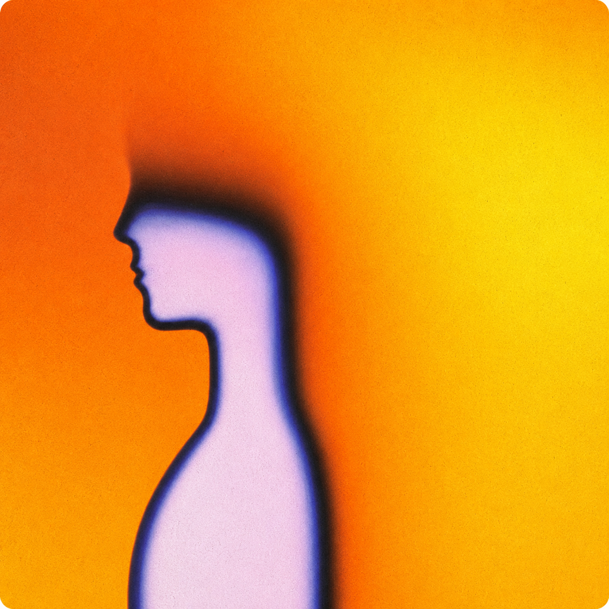

# Posture Nudge

**A gentle Mac reminder to sit up straight.**

Every so often, Posture Nudge briefly washes your screen with a calming color —
a quiet cue to reset your posture, unclench, and breathe. No webcam, no account,
no nagging notifications.

---

## Install

1. [**Download the DMG**](https://github.com/gylippus/posture-nudge-releases/releases/latest/download/PostureNudge.dmg).
2. Open it and drag **Posture Nudge** into your Applications folder.
3. Launch it. It lives in your **menu bar** (up by the clock) — there's no Dock icon or window.

Signed and notarized by Apple, so it opens with a normal double-click. Requires **macOS 14 (Sonoma) or newer**. It keeps itself up to date automatically.

## What it does

- **Gentle screen flash** — a soft, full-screen color fades in and out as your nudge, instead of a notification you'll ignore. Adjustable length and intensity.
- **Calming gradients** — a rotating set of abstract gradient themes (or pick a favorite), with an optional film-grain texture.
- **Stretch breaks** — every so often the nudge carries a short, neck-friendly cue like *"Chin tuck: draw your head back over your shoulders."* Fully editable.
- **A gentle tone** — an optional soft singing bowl, chime, or wood block, with a volume control.

## Stays out of your way

- **Pauses when you're away** — no nudging an empty desk.
- **Pauses in full-screen apps** — won't interrupt videos, presentations, or games.
- **Pauses during meetings** — detected when your mic is in use (no mic or camera permission needed).
- **Active hours** — optionally limit nudges to your working hours and weekdays.
- **Quick pause** — snooze for 15 / 30 / 60 minutes or until tomorrow.

## Controls

- **Menu bar** — enable/disable, flash now, change frequency, pause, settings.
- **Global shortcuts** — `⌃⌥⌘P` for a stretch break now, `⌃⌥⌘S` to snooze 30 minutes.
- **Launch at login** — on by default, so it's always quietly there.

## Privacy

Posture Nudge collects nothing and talks to no servers except GitHub, to check for updates. Meeting detection reads a system "is the microphone active" flag — it never accesses your microphone or camera.

---

Created by Ryan Hanna, founder of Sworkit Health. May you be happy, may you be healthy, may you be at peace.

